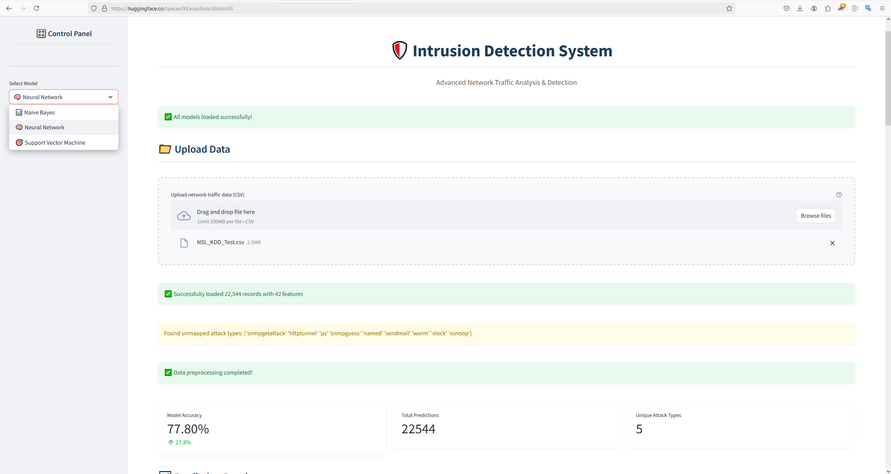

# 🛡️ IDS Enterprise - Hệ Thống Phát Hiện Xâm Nhập Thông Minh

  *Bảo vệ mạng doanh nghiệp của bạn với sức mạnh của AI*

## 🌟 Tính Năng Nổi Bật

🔍 **Phát Hiện Thông Minh**
- Phân loại 5 loại tấn công chính xác
- Giao diện web trực quan

⚡ **Hiệu Năng Cao**
- Xử lý nhanh với Naive Bayes
- Độ chính xác tối ưu với SVM/ANN

🎯 **Dễ Dàng Sử Dụng**
- Không cần kiến thức chuyên sâu
- Tích hợp nhanh chóng
- Báo cáo chi tiết trực quan

## 🚀 Quick Start

### 1️⃣ Truy Cập Tool
```
📌 https://huggingface.co/spaces/KException/idstoolit3
```

### 2️⃣ Upload Dữ Liệu
- Định dạng: CSV
- Kích thước: < 200MB
- Chuẩn NSL_KDD (41 đặc trưng)

### 3️⃣ Chọn Mô Hình

| Model | Ưu Điểm | Phù Hợp |
|-------|---------|----------|
| 🚄 **Naive Bayes** | Siêu nhanh | Dữ liệu nhỏ |
| 🎯 **SVM** | Cực chính xác | Phân tích sâu |
| 🧠 **ANN** | Thông minh | Dữ liệu phức tạp |

## 💻 Cài Đặt Local

```bash
# Clone repo
git clone https://github.com/Github-303/IDS_NB_SVM_ANN.git

# Cài đặt dependencies
pip install -r requirements.txt

# Chạy ứng dụng
python app.py
```

## 📊 Demo & Kết Quả



## 🔧 Yêu Cầu Hệ Thống

### Phần Cứng Tối Thiểu
```
CPU: Intel Core i5+
RAM: 8GB
Disk: 50GB
```

### Phần Mềm
```
OS: Windows 10/11, Ubuntu 20.04+, macOS 12+
Python: 3.7+
Browser: Chrome, Firefox, Safari
```

## 📝 Xử Lý Dữ Liệu NSL_KDD

### Format Dữ Liệu
```csv
duration,protocol_type,service,flag,src_bytes,dst_bytes,...
0,tcp,http,SF,181,5450,...
```

### Code Mẫu
```python
import pandas as pd

# Làm sạch dữ liệu
def clean_data(df):
    df = df.dropna()
    df['duration'] = df['duration'].astype(float)
    return df

# Xử lý file lớn
def split_file(filename, chunk_size=190):
    chunks = pd.read_csv(filename, chunksize=chunk_size*1024*1024)
    for i, chunk in enumerate(chunks):
        chunk.to_csv(f'chunk_{i}.csv', index=False)
```

## 👥 Nhóm Phát Triển

| Thành Viên | Vai Trò | Phụ Trách |
|------------|---------|-----------|
| **Khánh** | Lead | SVM + Kiến trúc |
| Tiến | Developer | Naive Bayes |
| AN + Du | Developer | ANN |

## 📬 Liên Hệ & Hỗ Trợ

Bạn cần giúp đỡ? Liên hệ ngay:
- 📧 Email: Bit220084@st.cmcu.edu.vn

---

<div align="center">
  <p>Made with ❤️ by IDS Enterprise Team</p>
  <p>© 2024 IDS Enterprise. All rights reserved.</p>
</div>
